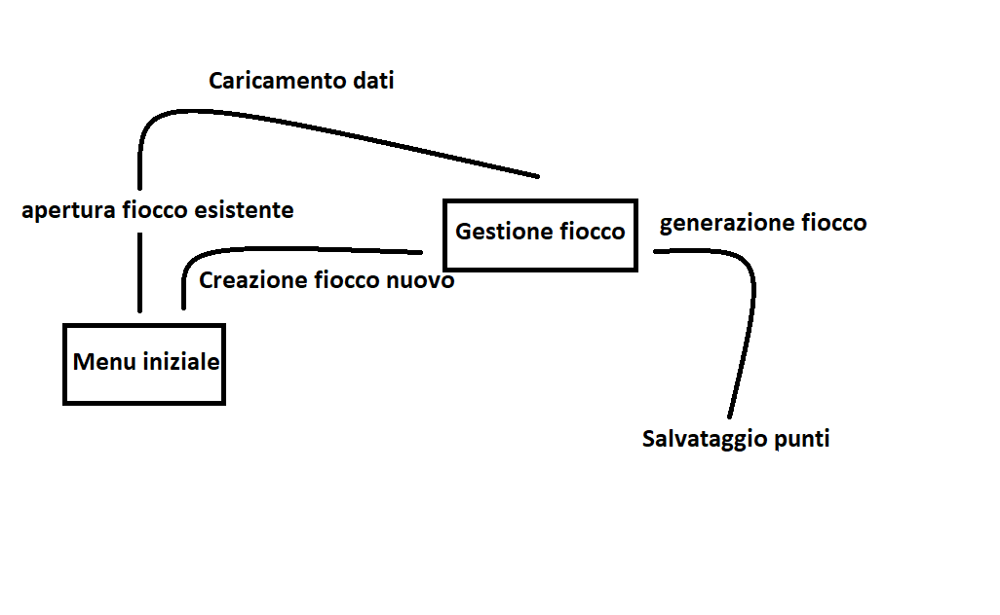

1. [Introduzione](#introduzione)

  - [Informazioni sul progetto](#informazioni-sul-progetto)

  - [Abstract](#abstract)

  - [Scopo](#scopo)

1. [Analisi](#analisi)

  - [Analisi del dominio](#analisi-del-dominio)

  - [Analisi dei mezzi](#analisi-dei-mezzi)

  - [Analisi e specifica dei requisiti](#analisi-e-specifica-dei-requisiti)

  - [Use case](#use-case)

  - [Pianificazione](#pianificazione)

1. [Progettazione](#progettazione)

  - [Design dell’architettura del sistema](#design-dell’architettura-del-sistema)

  - [Design dei dati e database](#design-dei-dati-e-database)

1. [Implementazione](#implementazione)

1. [Test](#test)

  - [Protocollo di test](#protocollo-di-test)

  - [Risultati test](#risultati-test)

  - [Mancanze/limitazioni conosciute](#mancanze/limitazioni-conosciute)

1. [Consuntivo](#consuntivo)

1. [Conclusioni](#conclusioni)

  - [Sviluppi futuri](#sviluppi-futuri)

  - [Considerazioni personali](#considerazioni-personali)

1. [Sitografia](#sitografia)

1. [Allegati](#allegati)

## Introduzione

### Informazioni sul progetto

  In questo progetto è stato coinvolto lo studente Georgiy Farina facente parte della classe I3AA della Scuola Arti e Mestieri di Trevano, sezione informatica. Il progetto è stato affidato dai docenti incaricati Luca Muggiasca e Geo Petrini, quest'ultimo anche supervisore, ed ha come data d'inizio il 07/09/19 e il termine previsto il 20/12/2019.

### Abstract

  Con l'utilizzo di questo strumento ora è possibile creare dei fiocchi in poco tempo semplicemente ritagliando un triangolo avendo così modo di scatenare all'infinito la propria fantasia facendo e rifacendo quanti fiocchi si vuole senza doverli buttare nel cestino nel caso non dovessero piacere.

### Scopo

  Lo scopo del progetto è quello di generare un fiocco di neve utilizzando gli scarti di un triangolo precedentemente ritagliato dall'utente e infine salvare il risultato come un immagine raster o vettoriale con le dimensioni desiderate dall'utente.

## Analisi

### Analisi del dominio

  Di solito siamo abituati a creare dei fiocchi di neve partendo da un foglio di carta, delle forbici e un po di fantasia mista a creatività. Utilizzando questo software sviluppato interamente in Java versione 12.0.1 avrete la possibilità di fare tutto ciò con un paio di click sul computer.

### Analisi e specifica dei requisiti

  |**ID**	|**Nome**|**Categoria**| **Priorità**|**Vers**|**Note**  |
  |----|------------|-------|--------|----|------|
  |01|Sito con descrizione software|Sito|4|1.0|...|
  |02|Possibilità di scaricare il software dal sito|Sito|3|1.0|...|
  |03|Lista di requisiti di sistema per l'utilizzo |Sito|1|1.0|...|
  |04|Presenza di interfaccia grafica|Software|1|1.0|...|
  |05|Il triangolo si deve trovare in centro del panel|Software|1|1.0|...|
  |06|Si deve poter resettare i punti di ritaglio|Software|1|1.0|...|
  |07|Presenza di un tasto "genera fiocco"|Software|1|1.0|...|
  |08|La generazione può avvenire in tempo reale|Software|1|1.0|...|
  |09|I punti possono essere spostati o rimossi|Software|1|1.0|...|
  |10|Si deve poter salvare il fiocco|Salvataggio fiocco|1|1.0|...|
  |11|Il salvataggio avviene in formato PNG o SVG|Salvataggio fiocco|1|1.0|...|
  |12|Le dimensioni dell'immagine sono definite dall'utente|Salvataggio fiocco|1|1.0|...|
  |13|Si può salvare i punti di ritaglio|Sito|1|1.0|...|
  |14|Finestra ridimensionabile con dimensioni default 1024x768|Interfaccia programma|1|1.0|...|

### Use case

### Pianificazione

### Analisi dei mezzi
 #### Software
  Il software è stato realizzato con l'utilizzo di NetBeans 11.1 e JDk 12.
  Il link del sito dove risiede il download del file è il seguente: samtinfo.ch/i17fargeo/Snowflake

 #### Hardware
 Il progetto è stato realizzato interamente su un computer portatile Acer A717-71G con sistema operativo Windows 10 Home.

## Progettazione

### 3.1 Menu iniziale

#### 3.1.1 Introduzione
Questa classe ha lo scopo di mostrare la schermata iniziale, dove vi è la possibilità di aprire un fiocco esistente o di crearne uno nuovo

#### 3.1.2 Progettazione - Diagramma UML

     

#### 3.1.3 Spiegazione UML
- percorso: percorso completo del file che si vuole aprire (già esistente)
- bottoneApri: bottone che si occupa di aprire un file già esistente
- bottoneCrea: bottone che si occupa di creare un fiocco nuovo.
- titolo: nome del programma
- StartMenu(): costruisce la finestra da far partire
- apriProgetto(ActionEvent evt): apre un file csv contenente le coordinate.
- creaProgetto(ActionEvent evt): apre un'altra finestra dove l'utente creerà il fiocco.
- loadCSV(String path): carica i punti dal csv definito dal suo percorso 'path'
- main(String args): fa partire il programma

### 3.2 Contenitore per la creazione del fiocco

#### 3.2.1 Introduzione
Questa classe mostra la creazione del fiocco gestita da un altra classe.

#### 3.2.2 Progettazione - Diagramma UML

     

#### 3.2.3 Spiegazione UML
- flakePanel: pannello che gestisce la creazione del fiocco.
- FlakeManagement(): costruisce la finestra con tutto di default.
- FlakeManagement(ArrayList<"Point"> punti): costruisce la finestra caricando i punti di un fiocco salvato. 
- main(String args): fa partire il programma.

### 3.3 Gestione e creazione del fiocco.

#### 3.3.1 Introduzione
Questa classe si occupa della creazione e generazione del fiocco.

#### 3.3.2 Progettazione - Diagramma UML

  
  

  #### 3.2.3 Spiegazione UML
- coloreSfondoSinistro: colore di sfondo della parte sinistra della finestra
- coloreSfondoDestro: colore di sfondo della parte destra della finestra
- coloreTriangoloOriginale: colore di sfondo del triangolo non modificato.
- colorePunti: colore di sfondo dei punti di ritaglio.
- coloreForma: colore di sfondo della forma di ritaglio. 
- raggio: lunghezza del raggio dei punti di ritaglio.
- panelCenter: la coordinata x a metà del panel.
- height: altezza del panel
- coloreForma: colore di sfondo della forma di ritaglio.  
- punti: i punti della forma di ritaglio. 
- puntiDaSalvare: la variabile che utilizzo per salvare i punti.
- bordoOrizzontale: il bordo tra l'estremo sinistro della finestra e il primo vertice del triangolo.
- catetoMaggiore: lunghezza del cateto maggiore del triangolo.
- catetoMinore: lunghezza del cateto minore del triangolo.
- ipotenusa: lunghezza dell'ipotenusa.
- centroFiocco: coordinata x del vertice più in basso del triangolo, che in futuro sarà il centro del fiocco.
- forma: forma di ritaglio.
- triangolo: triangolo di default.
- triangoloFinale: triangolo ritagliato
- areaForma: area della forma di ritaglio.
- areaTriangoloOriginale: area del triangolo di default.
- areaTriangoloRitagliato: area del triangolo ritagliato.
- fioccoFinale: fiocco composto da 12 triangoli.
- disegnaTriangoloOriginale: flag che stabilisce se devo mostrare a schermo il triangolo originale.
- disegnaTriangoloFinito: flag che stabilisce se devo mostrare a schermo il triangolo ritagliato.
- disegnaForma: flag che stabilisce se devo mostrare a schermo la forma di ritaglio.
- disegnaFiocco: flag che stabilisce se devo mostrare a schermo il fiocco.
- fileCaricato: flag che stabilisce se sono stati importati dei punti da altrove.
- percorsoSalvataggioPunti: percorso completo di dove si deve salvare i punti di ritaglio.
- generazioneLive: flag che stabilisce se la generazione dev'essere eseguita in live o meno.
- bottoneGenera: bottone utile per generare il fiocco.
- bottoneIndietro: bottone utile per tornare alla schermata iniziale
- bottoneLive: bottone utile per attivare la generazione in live.
- bottonePNG: bottone utile per generare il PNG del fiocco (non implementato).
- bottoneReset: bottone utile resettare tutto
- bottoneSalva: bottone utile per salvare i punti in un nuovo file.
- bottoneTaglia: bottone utile tagliare il triangolo con la forma.
- FlakePanel(): costruisce la schermata
- addPoint(Point p): aggiunge alla lista di punti il punto p
- removeLastPoint(): toglie dalla lista di punti l'ultimo.
- addShape(Shape s): aggiunge al fiocco la shape s.
- loadPunti(ArrayList<"Point"> punti): carica i punti di ritaglio passati da altrove.
- salvaSuNuovoFile(): chiede un nuovo percorso dove salvare i punti.
- salvaSuStessoFile(): chiede un nuovo percorso dove salvare i punti.
- tagliaTriangoloConBottone(): taglia il triangolo senza la modalità live.
- tagliaTriangoloInLive(): chiede un nuovo percorso dove salvare i punti.
- specchiaTriangolo(): taglia il triangolo senza la modalità live.
- tagliaTriangoloInLive(): chiede un nuovo percorso dove salvare i punti.

- main(String args): fa partire il programma.
     

## Implementazione

### Menu iniziale

##### apriProgetto()

     

## Test

### Protocollo di test

|Test Case      | TC-001                               |
|---------------|--------------------------------------|
|**Nome**       |Sito con download, descrizione e minimi requisiti del software|
|**Riferimento**|REQ-01, REQ-02, REQ-03                               |
|**Descrizione**|Bisogna vedere se c'è il sito per poter scaricare il software e se vi sono presenti descrizione e requisiti minimi per l'utilizzo|
|**Prerequisiti**|Programma pubblicato e finito sul git|
|**Procedura**     |andare sul sito citato nell'analisi del software e verificare il download provando a scaricare il programma|
|**Risultati attesi** |Il download parte con successo|

### Risultati test

Tabella riassuntiva in cui si inseriscono i test riusciti e non del
prodotto finale. Se un test non riesce e viene corretto l’errore, questo
dovrà risultare nel documento finale come riuscito (la procedura della
correzione apparirà nel diario), altrimenti dovrà essere descritto
l’errore con eventuali ipotesi di correzione.

### Mancanze/limitazioni conosciute

Per mancanza di tempo data dalle difficoltà incontrate durante l'implementazione, mancano i seguenti punti:
- salvataggio dell'immagine PNG e SVG
- ridimensionamento della schermata

## Consuntivo

## Conclusioni

L'applicativo sviluppato facilita il compito della generazione di un fiocco, fatta precedentemente a mano. 
Dopo aver svolto il progetto mi sono accorto di quanta importanza si debba dare al metterci più impegno di quello che si pensa si debba dare, altrimenti si finisce come me che ho preso la maggior parte degli aspetti sottogamba. Non bisogna sottovalutare i requisiti.
Per quanto riguarda le disponibilità dell'utente nell'utilizzo, sicuramente si potrebbe fare di più, migliorare qualche dettaglio tralasciato per mancanza di tempo.

## Bibliografia

### Sitografia

- https://stackoverflow.com, Stack Overflow, da 06.09 a 20.12
- https://w3schools.com, W3Schools, da 13.12 a 20.12

**Esempio:**

-   http://standards.ieee.org/guides/style/section7.html, *IEEE
    Standards Style Manual*, 07-06-2008.

## Allegati

Elenco degli allegati, esempio:

-   Diari di lavoro

-   Codici sorgente

-   Sito con download e regole d'uso

-   Qdc

-   Prodotto
